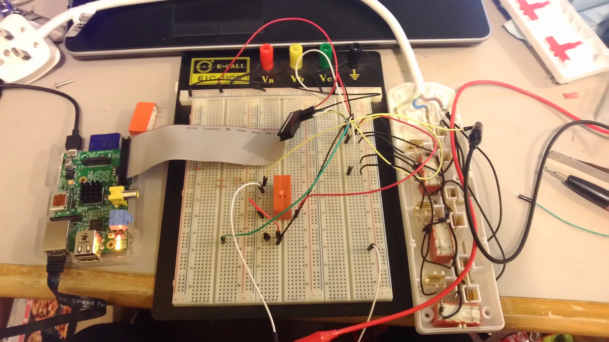

Thermostat
-------------

A simple thermostat for Raspberry Pi using [DS18B20](https://www.maximintegrated.com/en/products/analog/sensors-and-sensor-interface/DS18B20.html "DS18B20") and [Flask](http://flask.pocoo.org/)

Features
========

 * A calendar for scheduling temperatures
 * A performance graph showing how often the heater is switched on/off
 * Nice big temperature display
 * Suitable for electric heaters

As a bonus, you can control other appliances if your relay board has more than one channel.

Operation
=========

Two things are connected to the GPIO of the RPi:

 * A relay board - controlled via the [RPi.GPIO](https://pypi.python.org/pypi/RPi.GPIO) library
 * A DS18B20 thermometer

The `engine.py` contains all the logic for controlling the relays

Motivation
==========

As an international student, life quality sucks in the UK when the heater has no built-in thermostat. 
Since I'm a computer science student, I decided to build my own with a Raspberry Pi, relay board, and a DS18B20 thermometer.

How to build
=============
(Assuming you're doing this on the RPi running Raspbian , I've never tested the following on any other platform)

First, install Flask:

    sudo pip install Flask

then simply run:

    python interface.py

Note that you might need to modify the following files to match your setup:

 * `ds18b20.py` - the constant `DEFAULT_DS18B20_DIR` needs to point to your DS18B20
 * `hal.py` - the constant `MAPPING` needs to modified to match your relay board setup. In my case, it's a homemade 3 socket extension cord that looked like this:

And yes, the extension is bought from poundland :)

**DS18B20 setup**

There are [several](https://learn.adafruit.com/downloads/pdf/adafruits-raspberry-pi-lesson-11-ds18b20-temperature-sensing.pdf) [tutorials](https://www.cl.cam.ac.uk/projects/raspberrypi/tutorials/temperature/) on this topic to help you get your DS18B20 up and running.

TODO
====

 * Deleting scheduled temperature changes on the calendar clears the entire calendar
 * Add moisture sensing

